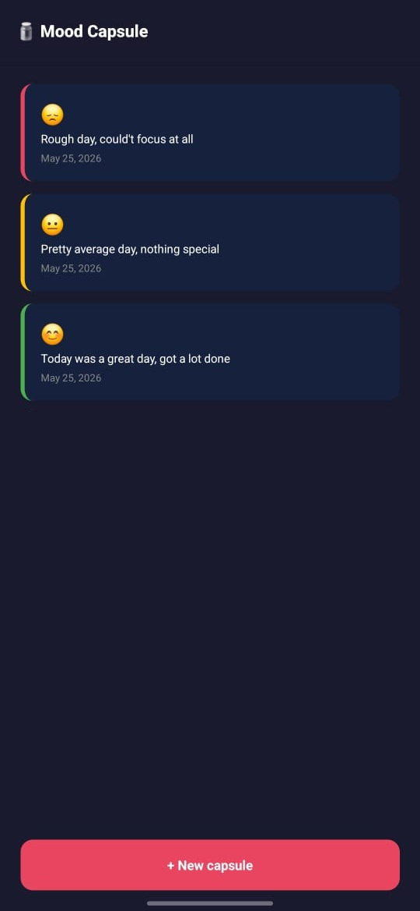
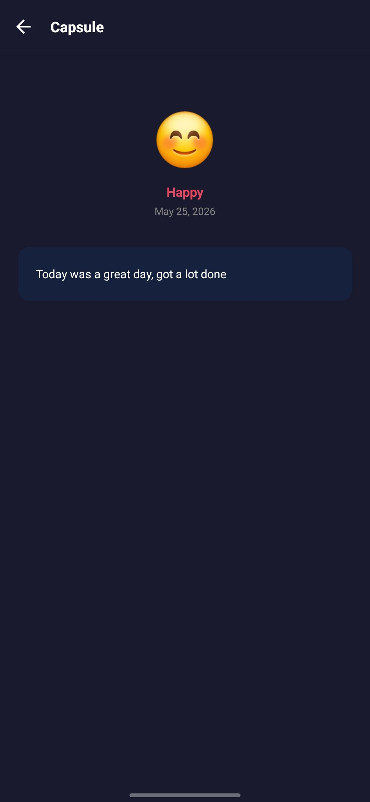

# 🫙 Mood Capsule

A mobile app to log your daily mood and revisit past entries.

## Built with

- React Native
- Expo
- React Navigation
- AsyncStorage

## Features

- Log your daily mood (happy, neutral, bad) with a short note
- View all past capsules sorted by most recent
- Tap any capsule to read the full entry
- Data persists locally on your device

## Screenshots

| Home | Detail |
|------|--------|
|  |  |

## Getting started

```bash
npm install
npx expo start
```

Scan the QR code with the Expo Go app on your phone.